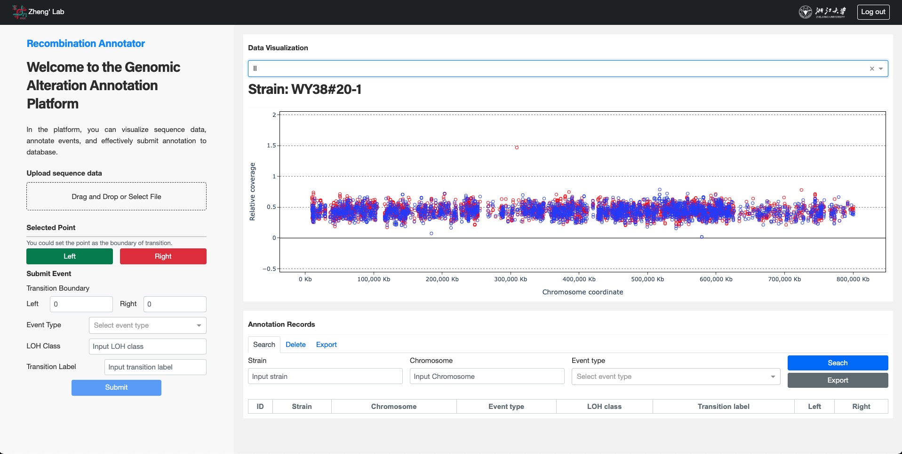

# Recombination-Annotator
This is a open code for online application "Genomic Alteration Annotation Platform". In the platform, you can visualize specific sequence data, annotate recombination events, and effectively submit annotation to your own database.

## Quick setup

You may clone the repository and open your terminal/command in the root folder. Before running the application, you need to create a virtual environment by anaconda.

```
git clone https://github.com/ZJUOC-ZhengLab/Recombination-Annotator.git
cd Recombination-Annotator
conda create --name annotator python==3.8
conda activate annotator
```

Install all required packages by running:
```
pip install -r requirements.txt
```

You could run this app locally with:
```
python app.py
```

If you want to release this app on the intranet, you could run this app with `Gunicorn` server, which is a python web server gateway interface HTTP server.
```
pip install gunicorn

gunicorn app:server --workers 8 -b :11122
```


## Screenshot



## Citation

```bibtex
@misc{recoman,
  title={Recombination Annotator},
  author={Xiaozhuan Liang, Daoqiong Zheng},
  year={2025},
  howpublished={\url{https://github.com/ZJUOC-ZhengLab/Recombination-Annotator}}
}
```
